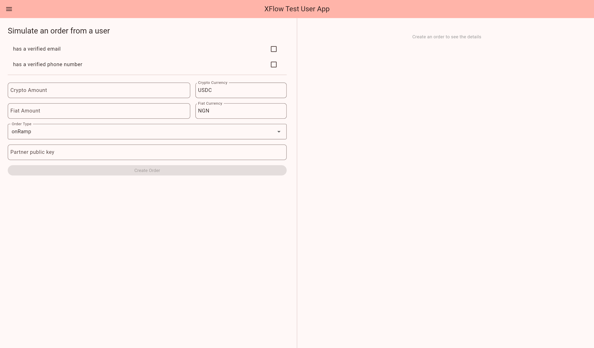

# Test User App

To simulate order created by a user and verify your setup, you can use [XFlow Test User App](https://espresso-cash.github.io/xflow-user-test-app/). There are 2 modes, simple and advanced.

## Simple mode

In [simple mode](https://espresso-cash.github.io/xflow-user-test-app/#/simple), you can quickly create an order from a new user.

<figure><figcaption></figcaption></figure>

Enter your public key into `Partner public key` field, set crypto and fiat amount, currencies, and select order type (on-ramp or off-ramp). You can optionally check `has a verified email` and `has a verified phone number` fields, so that the user will have the corresponding data verified by a test validator.

After filling the fields, press `Create Order` button and if everything is set up correctly according to [quickstart.md](../getting-started/quickstart.md "mention"), you will receive a webhook event with data about the new order.

The order will also be displayed on the right side of the page:

<figure><figcaption></figcaption></figure>

Once you update the order status from your code, you can tap refresh button to display the latest order status.

## Advanced mode

In [advanced mode](https://espresso-cash.github.io/xflow-user-test-app/#/advanced), you have more control over the user parameters.

<figure><figcaption></figcaption></figure>

<figure><figcaption></figcaption></figure>

You can either create a new user using `Init wallet` button, or import existing wallet by entering mnemonic.

Also, in this mode, you have full control over user data, and can independently set and validate:

* email;
* phone number;
* personal data and document: name, date of birth, document type and number, country code, and selfie image for document verification;
* bank data that will be used during order creation.


Email and phone number are validated automatically – any data will be marked as "validated" after pressing corresponding "Validate" buttons. No real confirmation codes are sent.

For document validation, SmileID test mode is used. This is mode is limited, to pass validation use the following data:

* ID Type: `Voter ID`
* Document number: `0000000000000000004`
* Country code: `NG`
* Selfie: selfie image in JPEG format less than 300Kb

Document validation usually takes some time, so press "Refresh" button in the User data section to fetch the latest validation status.


Once data are validated, you can see the green check marks:

<figure><figcaption></figcaption></figure>

Before creating an order, you need to grant access on behalf of the user to their data by entering your partner public key and pressing `Grant access`. After that, you can create a new order using the form in the right side, similar to simple mode.
