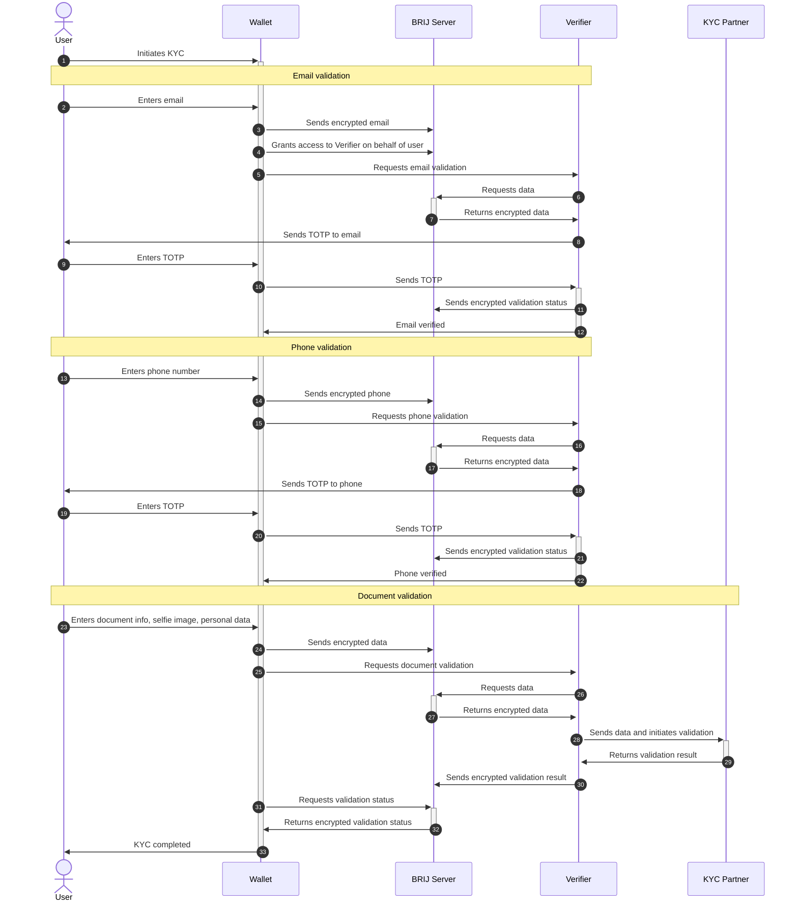

# KYC Flow

Before user can create orders on the platform, they need to pass KYC.

<figure><figcaption>
KYC flow overview
</figcaption></figure>

1. **User** initiates KYC in the compatible **Wallet**. **User** provides required data (email, phone number, document etc.)
2. **Wallet** locally encrypts data and uploads them to **BRIJ Server.**
3. **Wallet** requests KYC from one of the compatible **Verifiers** (currently, there's only one Verifier available).
4. **Verifier** verifies some data on its own (e.g. email and phone number) by sending verification code.
5. **User** enters the code in the **Wallet.**
6. **Wallet** sends code to **Verifier.**
7. **Verifier** confirms the code and marks the corresponding data as verified in the **BRIJ Server**.
8. For other data, **Verifier** can use one of the **KYC Partners** (e.g. SmileID). **Verifier** uploads data to **KYC Partner** and requests verification.
9. **KYC Partner** returns verification response to **Verifier**.
10. **Verifier** uploads verification result and verification response from **KYC Partner** to **BRIJ Server**.
11. **BRIJ Server** returns encrypted verification result to **Wallet**. KYC is completed.

Detailed sequence diagram of the KYC Flow is provided here:

