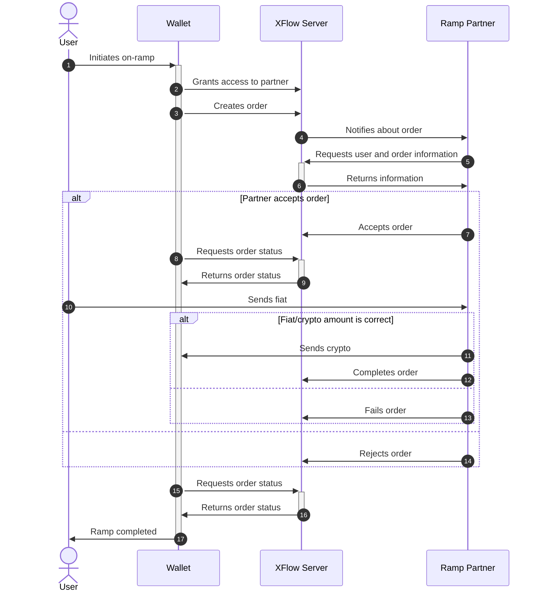
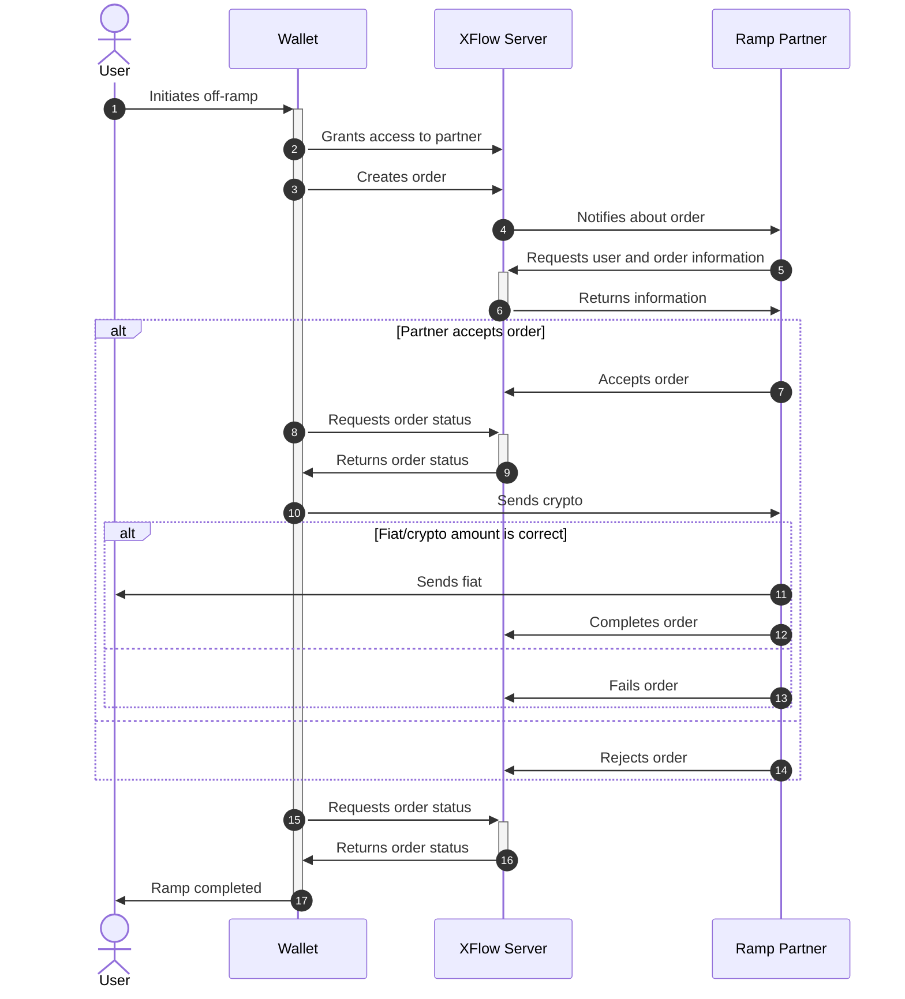

# Order flow

<figure><figcaption>
Order flow overview
</figcaption></figure>

1. **User** initiates onramp or offramp in **Wallet**.
2. **Wallet** shares access to the selected **Partner** and creates order on **XFlow Server**.
3. **XFlow Server** notifies **Partner** about new order using webhook provided by **Partner**.
4. **Partner** gets order details, confirms the order, and retrieves user data using [Client SDK](../getting-started/quickstart.md).
5. **Partner** processes the order using their internal business logic.
6. **Partner** notifies **XFlow Server** about order completion using Client SDK.
7. **XFlow Server** notifies **Wallet** about order completion.

Detailed sequence diagram of the On-Ramp Flow is provided here:

Detailed sequence diagram of the Off-Ramp Flow is provided here:

